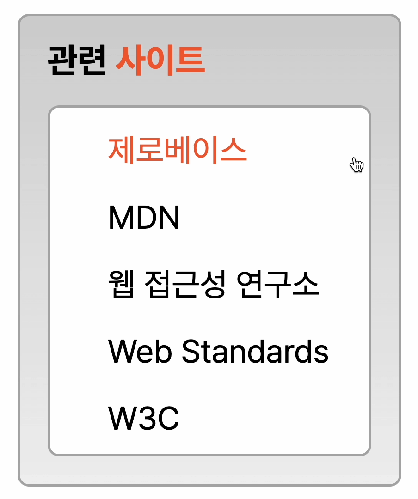

# transition을 활용한 관련 사이트 구현

## 페이지 구현 결과

  파일 목록 중 'transition 구현 결과.mov'는 구현 결과에 대한 영상 파일입니다.

## HTML 작성사항
- '''<head>
  + 자세한 meta 요소 명시로 SEO 고려
    * 저자, 키워드, 설명 등과 같이 문서의 정보를 기입함으로써 SEO(검색엔진최적화)를 고려함
  + 적절한 title 사용
    * 페이지의 내용을 한눈에 알 수 있도록 title을 '웹카페 - 관련 사이트'로 지정
- <body>
  + main > section > h2 + ul > li > a 구조로 구성
    * 웹카페 전체 페이지를 고려했을 때 해당 내용은 <main> 내 <section> 중 하나이므로 <section> 태그로 묶음
    * 웹카페 로고가 대제목을 의미한다고 판단하여 해당 section에 대한 제목인 '관련 사이트'는 <h2>로 마크업
    * 관련 사이트라는 맥락으로 사이트가 나열되는 구조이므로 순서가 없는 리스트를 표현하는 <ul>, <li> 요소를 활용
    * 사이트는 클릭 시 바로 이동할 수 있도록 <a> 태그를 활용
  + 적절한 요소를 활용한 마크업
    * 제목 중 '사이트'와 같이 강조해야 하는 내용을 <strong>을 활용하여 마크업
    * 링크 클릭 시 새 탭으로 열 수 있도록 <a> 태그에 'targer="_blank"' 속성을 추가
- 문법 오류 방지
  * Web Developer를 활용하여 HTML, CSS 문법 오류를 검수함

## CSS 작성사항
- 생산성, 유지보수 측면 고려
  * 페이지 내 2번 이상 사용되는 색상은 가상클래스를 활용하여 작용할 수 있도록 정의해 둠(:root)
- 브라우저별 편차를 고려
  * margin, padding 값을 0으로 리셋
- 공통 요소의 중복 작성 예방
  * 기본적으로 적용할 글꼴, 글자 크기, 행간 등을 공통 요소로 설정하여 중복하여 사용하지 않도록 함 
  * 공통적으로 적용되는 요소는 클래스별로 묶어 한 번에 적용(border, border-radius와 같이 2번 이상 사용되는 요소를 묶어 한번에 선언)  
- 그라데이션 효과 적용
  * linear-gradient() 함수를 활용하여 그라데이션 효과 구현
- 링크 클릭의 범위를 넓게 설정
  * <a> 태그에 정의된 클래스값에 padding을 설정하여 클릭의 면적을 넓힘
- :hover를 다양하게 활용
  * 마우스를 올리기 전 1개의 사이트만 보이던 것을 높이 설정을 통해 마우스를 올렸을 때 전체 리스트를 볼 수 있도록 함
  * 마우스를 올렸을 때 선택된 콘텐츠 색상에 변화를 주어 어떤 요소를 선택했는지 인지할 수 있도록 함
  * 해당 디자인 시안의 경우 리스트별 구분선이 없어 마우스를 올렸을 때 어떤 링크에 포커스가 되어 있는지 클릭 전 육안으로 확인할 수 없다는 측면에서 색상의 변화를 통해 시각적 효과를 줌
- :focus를 활용하여 웹 접근성을 고려
  * 키보드로 리스트에 접근할 수 있도록 하였으며 선택된 콘텐츠는 색상의 변화를 통해 인지할 수 있도록 함
- transition 활용
  * transition을 활용하여 사이트 리스트에 마우스를 올렸을 때 자연스럽게 리스트가 열릴 수 있도록 함