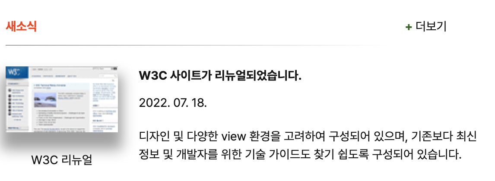
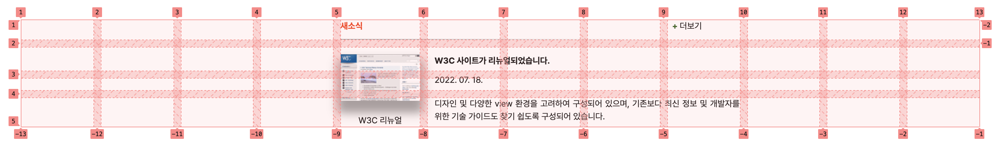
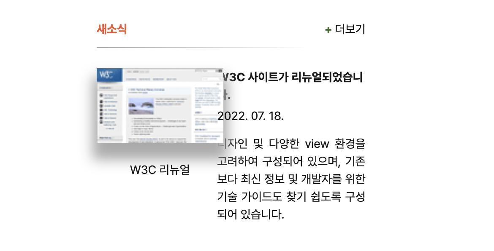

# grid를 활용한 새소식 구현

## 1. 페이지 구현 결과
- 전체 이미지
  
- grid overlays 적용
  


## 2. Markup

### 2.1 head
```
<head>
  <meta charset="UTF-8" />
  <meta name="viewport" content="width=device-width, initial-scale=1.0" />
  <meta name="author" content="ingbin" />
  <meta name="keywords" content="W3C,W3C리뉴얼" />
  <meta name="description" content="W3C 사이트 리뉴얼에 대한 소식입니다." />
  <title>웹카페 - 새소식</title>
  <link rel="stylesheet" crossorigin href="https://cdn.jsdelivr.net/gh/orioncactus/pretendard@v1.3.6/dist/web/static/pretendard-dynamic-subset.css" />
  <link rel="stylesheet" href="grid.css" />
</head>
```
- W3C 사이트 리뉴얼에 대한 내용이므로 &lt;mata&gt; 요소를 활용하여 키워드와 간단한 설명, 저자를 기재
- 웹카페 웹 페이지 중 새소식에 대한 내용이므로 &lt;title&gt;을 '웹카페 - 새소식'으로 지정

### 2.2 body
```
 <body>
  <main>
    <section class="container">
      <h2 class="news">새소식</h2>
      <h3 class="news-title">W3C 사이트가 리뉴얼되었습니다.</h3>
      <p class="news-text">디자인 및 다양한 view 환경을 고려하여 구성되어 있으며, 기존보다 최신 정보 및 개발자를 위한 기술 가이드도 찾기 쉽도록 구성되어 있습니다.</p>
      <figure class="news-thumbnail">
        <a href="https://www.w3.org/" title="W3C 사이트 바로가기" target="_blank"></a>
        <figcaption class="news-caption">W3C 리뉴얼</figcaption>
      </figure>
      <time datetime="2022-07-18" class="news-date">2022. 07. 18.</time>
      <a href="/" class="news-plus" target="_blank"><span class="news-icon">+ </span>더보기</a>
    </section>
  </main>
</body> 
```
- 웹카페라는 대제목 아래 '새소식'이라는 중제목을 &lt;h2&gt;로 마크업
- 새소식 중 W3C 사이트 리뉴얼에 대한 내용이므로 중제목과의 연관성이 있으면서 하위 레벨에 해당하므로 &lt;h3&gt;으로 마크업
- 소제목에 대한 내용(설명)이므로 &lt;p&gt;를 활용하여 내용을 단락으로 묶음
- &lt;figure&gt;를 활용하여 이미지를 마크업 하였으며 리뉴얼된 페이지를 바로 접속할 수 있도록 이미지에 &lt;a&gt;와 'target' 속성을 주어 링크 클릭 시 새창으로 열 수 있도록 하였으며, 마우스를 올렸을 때 해당 링크가 어디로 이동하는지 'title'을 지정함
- &lt;time&gt;을 활용하여 날짜라는 것을 시맨틱하게 표현함
- 더보기의 경우 페이지 이외에 다양한 소식에 대한 부분을 안내하는 부분이므로 &lt;a&gt;로 처리하여 다른 소식들을 확인할 수 있는 페이지로 이동할 수 있도록 하였으며 'target' 속성을 활용하여 새창으로 열 수 있도록 함
- 더보기 앞 '+' 기호에 스타일을 적용하기 위해 의미없는 &lt;span&gt; 태그를 추가함


## 3. Styling
```
.container {
  margin: 50px;
  display: grid;
  grid-template-columns: repeat(12, 1fr);
  grid-template-rows: auto;
  gap: 12px;
}
```
- &lt;section&gt;에 {display: grid;} 값을 지정하여 하위에 위치한 내용들이 item이 되도록 함
```
.news {
  grid-area: 1 / 5 / 2 / 9;
  color: #ed552f;
  border-bottom: 1px solid;
  border-image: linear-gradient(to right, #A9A9A9, #FFF);
  border-image-slice: 1;
}
```
- border-bottom에 그라데이션 효과를 가지면서 끝으로 갈수록 선이 흐려지는 효과를 줌
```
.news-date {
  grid-area: 3 / 6 / 4 / 9;
  margin-top: -8px;
  width: 80px;
}
```
```
.news-plus {
  grid-area: 1 / 9 / 2 / 10;
  text-align: right;
  text-decoration: none;
  width: 57px;
  padding-bottom: 12px;
}
```
- 날짜(2022. 07. 18.)와 더보기는 viewport 크기가 작을 시 텍스트의 크기가 틀어지는 결과가 나옴에 따라 크기를 지정하고 W3C 리뉴얼 사이트에 대한 제목과 단락은 유동적으로 움직이되 날짜와 더보기는 크기값에 변화가 없도록 함
```
.news-plus:hover, .news-plus:focus {
  color: #AAA;
}
```
- 더보기에 마우스를 올리거나 키보드로 포커스를 주었을 때 글자색이 변하도록 하여 해당 위치에 있음을 알 수 있도록 함


## 4. 이슈
- 현재 전체 페이지(grid-column: 12)에서 로그인 및 웹 관련 용어가 위치한 영역은 3, 신규이벤트와 관련사이트 및 인기사이트가 위치한 영역은 2, 새소식이 차지하는 영역은 7로 설정. 이때 이미지가 차지하는 영역을 2로 설정했을 때 viewport의 크기에 따라 이미지와 W3C 사이트 리뉴얼에 대한 텍스트 사이 간의 간격이 눈에 띄게 넓어지거나 이미지와 텍스트가 서로 겹치는 현상이 발생함
- 이에 따라 기존에 이미지가 차지하는 영역을 2로 준 것에서 1로 값을 변경하자 viewport의 크기에 변동이 생겨도 이미지와 텍스트가 겹치는 현상이 일어나지 않음
- 이미지의 크기보다 grid 영역을 넓게 책정했을 때 grid의 유동성에 사이 간격이 좁아지다 겹치는 것으로 확인하고 이미지 크기와 유사하게 grid 영역을 지정하자 이러한 이슈는 확인되지 않음
- 겹침 현상이 발생한 이슈 이미지
  