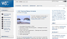

# grid를 활용한 새소식 구현

## 페이지 구현 결과

{: width="100" height="100"}
{: width="100" height="100"}

## Markup
### head
```
<head>
  <meta charset="UTF-8" />
  <meta name="viewport" content="width=device-width, initial-scale=1.0" />
  <meta name="author" content="ingbin" />
  <meta name="keywords" content="W3C,W3C리뉴얼" />
  <meta name="description" content="W3C 사이트 리뉴얼에 대한 소식입니다." />
  <title>웹카페 - 새소식</title>
  <link rel="stylesheet" crossorigin href="https://cdn.jsdelivr.net/gh/orioncactus/pretendard@v1.3.6/dist/web/static/pretendard-dynamic-subset.css" />
  <link rel="stylesheet" href="grid.css" />
</head>
```
- W3C 사이트 리뉴얼에 대한 내용이므로 &lt;mata&gt; 요소를 활용하여 키워드와 간단한 설명, 저자를 기재
- 웹카페 웹 페이지 중 새소식에 대한 내용이므로 &lt;title&gt;을 '웹카페 - 새소식'으로 지정

### body
```
 <body>
  <main>
    <section class="container">
      <h2 class="news">새소식</h2>
      <h3 class="news-title">W3C 사이트가 리뉴얼되었습니다.</h3>
      <p class="news-text">디자인 및 다양한 view 환경을 고려하여 구성되어 있으며, 기존보다 최신 정보 및 개발자를 위한 기술 가이드도 찾기 쉽도록 구성되어 있습니다.</p>
      <figure class="news-thumbnail">
        <a href="https://www.w3.org/" title="W3C 사이트 바로가기" target="_blank"></a>
        <figcaption class="news-caption">W3C 리뉴얼</figcaption>
      </figure>
      <time datetime="2022-07-18" class="news-date">2022. 07. 18.</time>
      <a href="/" class="news-plus" target="_blank"><span class="news-icon">+ </span>더보기</a>
    </section>
  </main>
</body> 
```
- 웹카페라는 대제목 아래 '새소식'이라는 중제목을 &lt;h2&gt;로 마크업
  ``` <h2 class="news">새소식</h2> ```
- 새소식 중 W3C 사이트 리뉴얼에 대한 내용이므로 중제목과의 연관성이 있으면서 하위 레벨에 해당하므로 &lt;h3&gt;으로 마크업
  ``` <h3 class="news-title">W3C 사이트가 리뉴얼되었습니다.</h3> ```
- 소제목에 대한 내용(설명)이므로 &lt;p&gt;를 활용하여 내용을 단락으로 묶음
  ``` <p class="news-text">디자인 및 다양한 view 환경을 고려하여 구성되어 있으며, 기존보다 최신 정보 및 개발자를 위한 기술 가이드도 찾기 쉽도록 구성되어 있습니다.</p> ```
- figure를 활용하여 이미지를 마크업 하였으며 리뉴얼된 페이지를 바로 접속할 수 있도록 이미지에 &lt;a&gt;와 'target' 속성을 주어 링크 클릭 시 새창으로 열 수 있도록 하였으며, 마우스를 올렸을 때 해당 링크가 어디로 이동하는지 'title'을 지정함
  ``` 
  <figure class="news-thumbnail">
        <a href="https://www.w3.org/" title="W3C 사이트 바로가기" target="_blank"></a>
        <figcaption class="news-caption">W3C 리뉴얼</figcaption>
      </figure>
      ```
- &lt;time&gt;을 활용하여 날짜라는 것을 시맨틱하게 표현함
  ``` <time datetime="2022-07-18" class="news-date">2022. 07. 18.</time> ```
- 더보기의 경우 페이지 이외에 다양한 소식에 대한 부분을 안내하는 부분이므로 &lt;a&gt;로 처리하여 다른 소식들을 확인할 수 있는 페이지로 이동할 수 있도록 하였으며 'target' 속성을 활용하여 새창으로 열 수 있도록 함
  ``` <a href="/" class="news-plus" target="_blank"><span class="news-icon">+ </span>더보기</a> ```

## Styling
