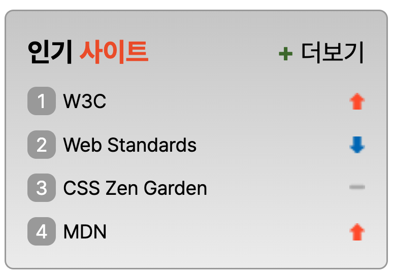

# sprite를 활용한 인기 사이트 구현

## 1. 페이지 구현 결과



## 2. Markup

### 2.1. head
- 웹 관련 사이트의 인기 순위에 대한 내용이므로 &lt;mata&gt; 요소를 활용하여 키워드와 간단한 설명, 저자를 기재하였으며, &lt;title&gt;은 '웹카페 - 인기 사이트'로 지정
```
<head>
  <meta charset="UTF-8" />
  <meta name="viewport" content="width=device-width, initial-scale=1.0" />
  <meta name="author" content="ingbin" />
  <meta name="keywords" content="W3C,Web Standards,CSS Zen Garden,MDN" />
  <meta name="description" content="웹카페 인기사이트 순위입니다." />
  <title>웹카페 - 인기 사이트</title>
  <link rel="preload" as="style" crossorigin
    href="https://cdn.jsdelivr.net/gh/orioncactus/pretendard@v1.3.6/dist/web/static/pretendard-dynamic-subset.css" />
  <link rel="stylesheet" href="sprite.css" />
</head>
```

### 2.2. body
- 웹카페라는 대제목 아래 '인기 사이트'라는 중제목을 &lt;h2&gt;로 마크업
- 순위에 대한 내용이므로 &lt;ol&gt;을 활용하여 리스트로 표현
- 사이트에 바로 접속할 수 있도록 &lt;a&gt;를 활용하여 사이트 리스트를 마크업
- 접근성 측면에서 단순히 '숫자 사이트명'보다는 'n위 사이트명'으로 스크린 리더가 읽을 수 있도록 'aria-label' 속성을 활용
- 4개 사이트는 접속 시 새 창으로 열도록 target="_blank" 속성을 활용하였으며 보안 측면에서 rel="noopener noreferrer" 속성을 추가함
- 더보기의 경우 다른 사이트로의 이동이 아니므로 target="_blank" 속성을 활용하여 새 창으로 여는 것은 4개 사이트 접속과 동일하나, 보안에 대한 속성인 rel="noopener noreferrer"은 부여하지 않음
- 링크에 'title' 속성을 추가하여 마우스를 올렸을 때 tooltip을 확인할 수 있도록 함
- 더보기 앞 '+' 기호에 스타일을 적용하기 위해 의미없는 &lt;span&gt; 태그를 추가함
```
 <body>
  <main>
    <section class="ranking">
      <div class="ranking-wrapper">
        <h2 class="ranking-title">인기 <span class="accent-primary-color">사이트</span></h2>
        <ol class="ranking-orderd-list">
          <li class="ranking-list">
            <a href="https://www.w3.org/" class="ranking-link" aria-label="1위 W3C" target="_blank"
              rel="noopener noreferrer" title="W3C 사이트 바로가기">W3C<span class="sprite sprite-first"></span></a>
          </li>
          <li class="ranking-list">
            <a href="https://www.w3.org/standards/" class="ranking-link" aria-label="2위 Web Standards" target="_blank"
              rel="noopener noreferrer" title="Web Standards 사이트 바로가기">Web
              Standards<span class="sprite sprite-second"></span></a>
          </li>
          <li class="ranking-list">
            <a href="https://www.csszengarden.com/" class="ranking-link" aria-label="3위 CSS Zen Garden" target="_blank"
              rel="noopener noreferrer" title="CSS Zen Garden 사이트 바로가기">CSS
              Zen Garden<span class="sprite sprite-third"></span></a>
          </li>
          <li class="ranking-list">
            <a href="https://developer.mozilla.org/ko/" class="ranking-link" aria-label="4위 MDN" target="_blank"
              rel="noopener noreferrer" title="MDN 사이트 바로가기">MDN<span class="sprite sprite-fourth"></span></a>
          </li>
        </ol>
        <a href="/" class="plus-link" target="_blank" title="인기사이트 순위 더보기" aria-hidden="true"><span
            class="plus-link-icon" aria-hidden="true">+ </span>더보기</a>
      </div>
    </section>
  </main>
</body> 
```


## 3. Styling
- 웹 페이지에 중복하여 사용되는 항목들은 var()와 결합하여 사용할 수 있도록 가상 클래스를 활용하여 정리함
- 추후 유지보수 측면에서 색상이나 크기의 전체적인 변경이 필요할 것을 대비함
```
:root {
  --primary-color: #ed552f;
  --border-gray: #A3A3A3;
  --plus-icon: #447231;
  --white: #fff;
  
  --spacing-xs: 4px;
  --spacing-sm: 8px;
  --spacing-base: 12px;
  
  
  --text-sm: 11px;
  --text-base: 14px;
  --text-md: 15px;
}
```
- 속성 선택자를 활용하여 class 중 링크를 포함하는 항목에 공통적으로 적용되는 스타일을 정의함
- 중복된 내용을 반복하여 작성하지 않았다는 측면에서 깔끔한 코드 구현이 가능
```
.ranking [class*="-link"] {
  text-decoration: none;
}
```
- position을 활용하여 '인기 사이트'라는 제목 옆에 더보기 링크를 배치
```
.ranking-wrapper {
  position: relative;
}

.plus-link {
  position: absolute;
  top: 0;
  right: 0;
  font-size: var(--text-base);
}
```
- counter-increment를 활용하여 css로 숫자를 생성하는 동시에 자동으로 번호를 매길 수 있도록 함
- 가상 요소를 활용하여 자동으로 매긴 번호를 삽입하고 이에 대한 스타일을 적용함
```
.ranking-list {
  counter-increment: number;
  font-size: var(--text-sm);
  padding-top: var(--spacing-sm);
  display: flex;
}

.ranking-list::before {
  content: counter(number);
  width: 16px;
  height: 16px;
  border-radius: 5px;
  background: var(--border-gray);
  color: var(--white);
  text-align: center;
  margin-right: var(--spacing-xs);
}
```
- sprite를 활용하여 순위변동을 표현
- 1개의 파일로 구성된 rank 관련 이미지를 배경으로 준 후 background-position을 활용하여 위치를 조정하여 활용
```
.sprite {
  background: url(./images/rank.png);
  width: 9px;
  height: 9.5px;
}

.sprite-first, .sprite-fourth {
  background-position: 0 0;
}

.sprite-second {
  background-position: 0 -46px;
}

.sprite-third {
  background-position: 0 -23px;
}
```
- flex를 활용하여 링크와 순위변동을 배치함
- space-between을 활용하여 링크와 sprite를 왼쪽과 오른쪽에 각각 배치하였으며 align-items를 활용하여 높이를 중앙에 위치하도록 함   
```
.ranking-link {
  display: flex;
  flex-flow: row nowrap;
  justify-content: space-between;
  align-items: center;
  flex-grow: 1;
  width: 100px;
}
```
- 더보기에 마우스를 올리거나 키보드로 포커스를 주었을 때 글자색이 변하도록 하여 해당 위치에 있음을 알 수 있도록 함
```
.plus-link:hover, .plus-link:focus {
  color: gray;
}
```